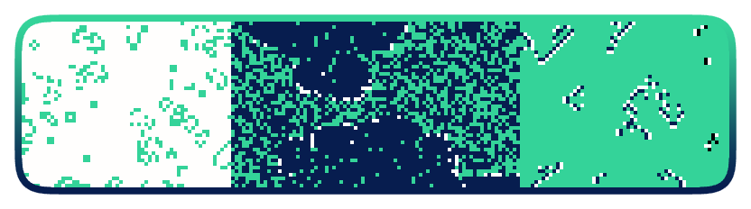

# Vivarium

<p align="center">
  
</p>

## Introduction

Vivarium is a TypeScript library that aims to provide a simple yet expressive way of creating your own cellular automata and run simulations on the web.

Vivarium exposes a minimal API that attempts to express complex rules and conditions in a way that resembles natural language. Concepts and technical terms from the cellular automata theory are almost transparent to the user. This way the cognitive effort of translating ideas into code is reduced. By lowering this barrier we enable fast prototyping during the creative coding process, especially for users who are approaching the cellular automata world for the first time.

Read the [docs](https://vivarium.orangenote.dev) to get started, or continue reading for a quick overview and [demo](https://vivarium-demo.netlify.app/).

## Overview

### Install

Install Vivarium as a dependency. No other dependencies required.

```bash
npm i @wonderyard/vivarium
```

```bash
pnpm add @wonderyard/vivarium
```

```bash
yarn add @wonderyard/vivarium
```

### Import

Import it once and use it anywhere.

```typescript
import { vivarium, setup } from "@wonderyard/vivarium";
```

### Create

To give you an idea of what the API can offer and how intuitive it can be to reason about rules and conditions, we recreated the most popular cellular automaton: [Conway's Game of Life](https://en.wikipedia.org/wiki/Conway%27s_Game_of_Life). Now featuring (with a little bit of imagination) green aliens 👽

> We suggest you to read about Game of Life and how it works before continuing reading. If you don't understand clearly what the following code is representing, it's okay! Visit the [docs](https://vivarium.orangenote.dev) for a gentler introduction to cellular automata and what vivarium is meant for.

```typescript
const vi = vivarium();

const space = vi.element("space", "blue");
const alien = vi.element("alien", "green");

// An alien is born if there's a family of 3 in the area.
space.to(alien).count(alien, 3);

// The alien stays if the area is neither too empty nor too crowded...
alien.to(alien).count(alien, 2, 3);

// ...otherwise the alien will leave the area forever.
alien.to(space);

const life = vi.create();
```

### Run

```typescript
// Create a new canvas (or you could use an existing one)
const canvas = document.createElement(canvas);
document.body.appendChild(canvas);

// Set the canvas size. This will be the automaton size as well.
const size = 512;
canvas.width = size;
canvas.height = size;

// Pass the canvas and the automaton you created to the setup function:
const { evolve } = setup({ canvas, automaton: life });

// Create a simple loop that evolves the canvas:
const loop = async () => {
  await evolve();
  requestAnimationFrame(loop);
}
requestAnimationFrame(loop);
```

[See the live demo here](https://vivarium-demo.netlify.app/)

## Browser compatibility

Vivarium runs its simulation entirely on the GPU thanks to the WebGPU API and its compute shaders. WebGPU is a relatively new technology. It is available since Chrome 113, Safari 26. See implementation status in other browsers [here](https://github.com/gpuweb/gpuweb/wiki/Implementation-Status). Vivarium has been tested on Chrome 139 for macOS and Safari 26.0 for macOS, showing better performances on Chrome overall.

## Contributing
Although I've been researching and experimenting with cellular automata for years, this is my first WebGPU-based project, so it might be rough around the edges. With WebGPU I've been able to achieve something it wouldn't be possible in a browser otherwise: to build something simple, customizable, and accessible for the end user, without compromising on performance. The intent is to offer this library as a learning tool and something other people can build on top of. If you share the vision and you would like to improve this software, PRs are welcome.
